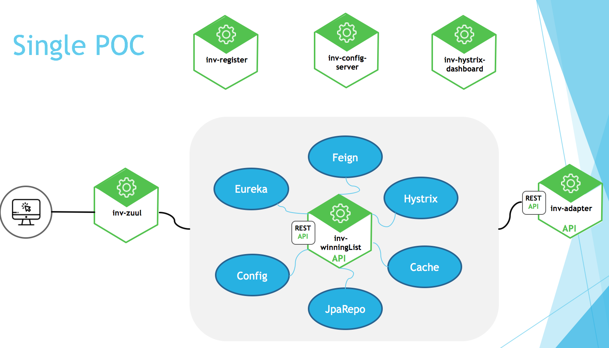
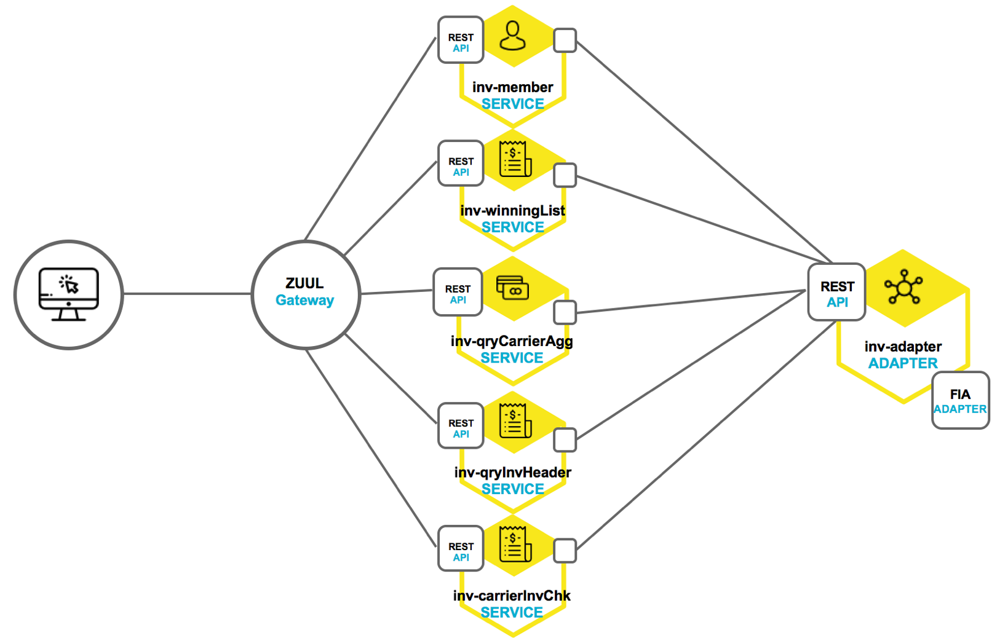

### Spring Cloud
Maven version : 3
Java version : 8

執行步驟：

1. mvn clean package (如果不是java8 ，請執行 mvn -Dhttps.protocols=TLSv1.2 clean package ) 
2. run-register.sh
3. run-config.sh
4. run-adapter.sh
5. run-poc.sh
6. run-dashboard.sh
7. run-zuul.sh
8. run-web.sh
一個一個起，從Eureka server確定服務存在

驗證：
1. Eureka server: http://localhost:8010/
2. Config server:
    http://localhost:8020/inv-winning-local.yml
3. dashboard : 
    http://localhost:8182/hystrix
      http://localhost:8030/actuator/hystrix.stream
4. inv-apapter server
    http://localhost:8005/swagger-ui.html
5. inv-winning
    http://localhost:8030/swagger-ui.html
6. inv-zuul
    http://localhost:8080/inv-adapter/swagger-ui.html
8. inv-web: (登入頁面)
    http://localhost:8081/login.html

single POC:

overall poc

